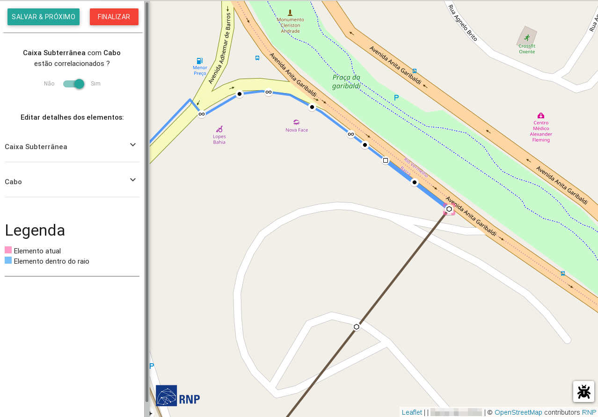

# Correlacionando elementos

Os elementos que foram inseridos no mapa podem não estar correlacionados entre si, por exemplo, quando importado do KMZ. É importante que eles estejam correlacionados para o melhor funcionamento da aplicação.

!> O correlacionar serve para indicar que um elemento está anexado a outro elemento, ou vice-versa.

!> Note que o elemento anexado a outro, é representado com a borda na cor cinza.

Clique no botão **Correlacionar Elementos**  para iniciar o processo de correlação.

[markdown video](img/correlacionar.mp4 ':include :type=video width=100% controls loop') 

O **GIIRO** irá tentar correlacionar os elementos que estão **próximos geograficamente** entre si. O usuário deverá indicar se os dois elementos apresentados estão correlacionados ou não, basta **mudar a opção** abaixo da pergunta. A correlação termina quando todos os elementos estão correlacionados ou quando o usuário clica em **Finalizar**.

## Próximos passos...

* [Edição de informações dos elementos](primeiros_passos/edicao-elementos.md)
