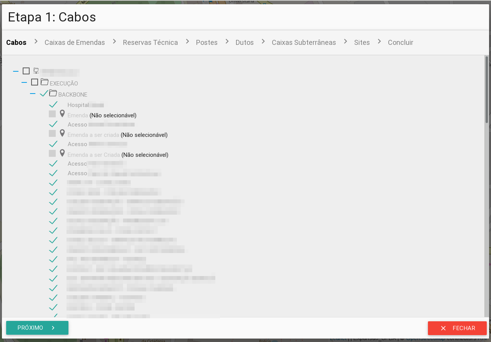
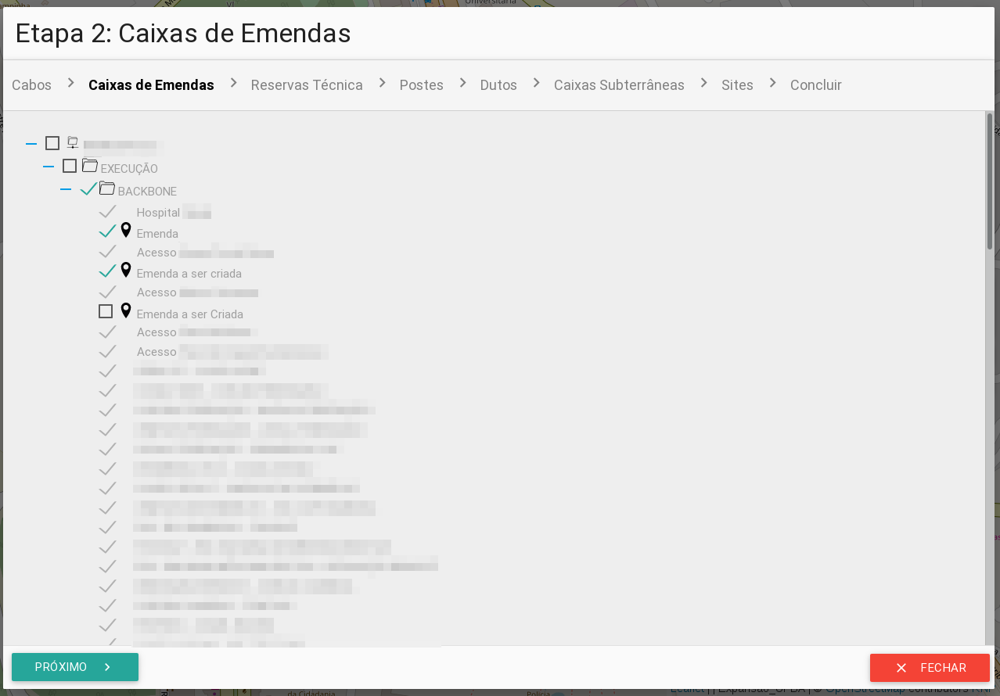

# Importando elementos a partir de um arquivo KMZ/KML

Se a sua rede já está salva em um **arquivo KMZ/KML**, você pode importá-la para o **GIIRO** utilizando a ferramenta de importação. Esta ferramenta é simples e dividida em algumas etapas.

Clique no botão **Importar KMZ**  no canto **superior esquerdo**.

Após escolher o seu **KMZ/KML**, em cada etapa você deverá marcar qual item do seu arquivo que corresponde ao elemento que será adicionado no mapa. Por exemplo, na primeira etapa você deverá escolher quais são os itens que correspondem a **Cabo**. Itens que possuem apenas um ponto geográfico com coordenada, não poderão ser selecionados nesta etapa. Você poderá marcar o quadrado ao lado do nome da pasta e **todos os itens contidos nesta pasta** serão marcados (os itens que não podem ser marcados serão ignorados).

!> Cada etapa é para um tipo de elemento. Uma vez selecionado este elemento, ele não poderá ser escolhido novamente nas etapas seguintes.

Etapa 1: Importação de **Cabos**.

Etapa 2: Importação de **Caixa de Emendas**.

!> Dependendo do tamanho do arquivo e da quantidade de elementos, este procedimento pode demorar. Aguarde a confirmação do procedimento.

## Próximos passos...

Os elementos que foram inseridos no mapa não estão correlacionados entre si. É importante que eles estejam correlacionados para o funcionamento da aplicação.

* [Correlacionar elementos](primeiros_passos/correlacionar-elementos.md)
