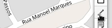

# Desenhando um mapa do zero!

### Desenhando a partir de linhas

#### Inserindo elementos do tipo linha

Se você prefere inserir os elementos começando por **Cabos** e **Dutos**, basta selecionar o elemento desejado e começar a desenhar pelo mapa. Escolha um **ponto inicial** e depois selecione os pontos por onde o elemento da rede irá passar. Você pode ainda apagar o último segmento desenhado, caso tenha errado a posição, clicando no botão **Apagar útlimo segmento**.

#### Inserindo elementos do tipo marcador

Você pode inserir marcadores livremente no mapa, porém se você deseja associar diretamente o elemento a um **Cabo** ou **Duto**, selecione a opção **Adicionar ao Cabo** e escolha a posição em que o elemento será adicionado ao **Cabo**.

[markdown video](img/adicionar-ao-cabo.mp4 ':include :type=video') 

## Próximos passos...

* [Edição de informações dos elementos](primeiros_passos/edicao-elementos.md)
