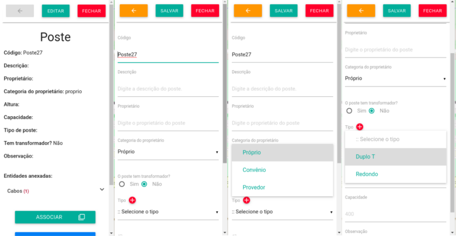
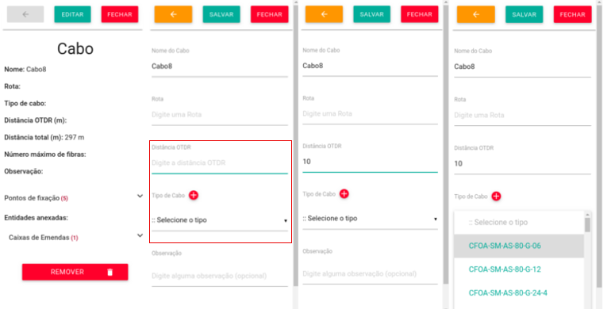
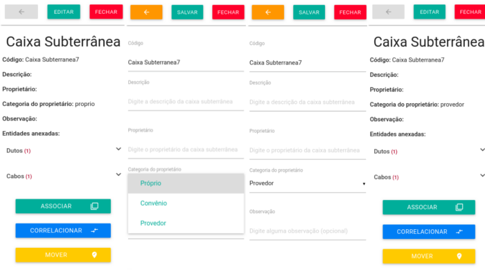
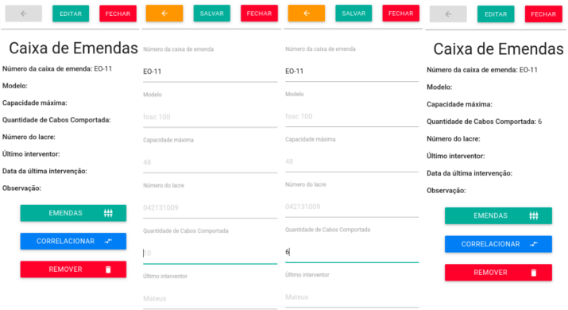

# Edição de informações dos elementos!

Para inserir ou editar informações sobre um determinado elemento, basta clicá-lo e uma aba será aberta para exibição e edição das informações.

### Elemento Poste

As informações mais importantes para o **GIIRO**, referente ao poste, são: **Categoria do Proprietário** e o **Tipo**, porque estes dados serão posteriormente utilizados para a geração de relatórios.

### Elemento Cabo

As informações mais importantes referente ao cabo, são: **Ditância OTDR**, que será importante para a área de relatórios e o **Tipo do Cabo**, que será importante para a realização das emendas.

### Elemento Caixa Subterrânea

Na Caixa Subterrânea é importante que o campo **Categoria do Proprietário** esteja com a informação correta, pois será importante para a área de relatórios. Por padrão, vem sempre como **própio** mas quando não for, basta clicar em editar a Caixa Subterrânea para alterá-la.

### Elemento Caixa de Emendas

Para a área de relatórios, é importante que na Caixa de Emendas o campo **Quantidade de Cabo** esteja com algum valor.

