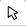

# Guia rápido

No seguinte guia, você encontra as informações mais importantes para começar a utilizar o GIIRO.

## Painel de Controle do usuário

No **Painel de Controle** o usuário tem acesso a uma visão geral dos usuários e dos elementos já cadastrados. No **Menu lateral** encontram-se as opções para cadastro de mapas, equipamentos, usuários (caso do administrador) e configurações padrão de elementos da rede.

## Gerenciar mapas
No **Menu lateral** em **Cadastrar|Visualizar > Mapas** encontra-se os mapas cadastrados pelo usuário ou compartilhados com ele.

O botão **Cadastrar mapa** na parte superior, permite a criação de um novo mapa pelo usuário assim como **Visualizar mapa** permite a visualização de mais de um mapa selecionado, na coluna "Marcar".

!> Durante a visualização de mais de um mapa ao mesmo tempo, não é permitida a edição de mapas.

Na coluna **Opções** dependendo das permissões do usuário e do tipo do mapa é possível realizar as seguintes ações:
-  Edita as informações daquele mapa.
-  Visualiza somente aquele mapa permitindo editar todos os seus elementos.
-  Importação dos dados georreferenciados de **postes** e **sites** via arquivo CSV.
-  Compartilha o mapa com outros usuários.
-  Define a posição inicial no qual o mapa será carregado.
-  Exporta os elementos do mapa em um arquivo do tipo `KMZ`.
-  Exclui o mapa e todos os elementos contidos nele.

## Visualizando mapas

Ao clicar no botão **Visualizar mapa** o usuário é redirecionado para a área de visão do mapa. Neste local é possível realizar a inserção, remoção e edição dos ativos da rede assim como a busca de localidades pelo seu endereço, importação de elementos contidos em um arquivo do tipo KMZ/KML, correlação de elementos do mapa além de outras funcionalidades. Essas funcionalidades são realizadas através dos seguintes botões:

No canto superior esquerdo:
-  Aumenta o zoom.
-  Diminui o zoom.
-  Busca a localização do mapa pelo endereço.
-  Importa os elementos contidos em um arquivo KMZ.
-  Inicia a correlação entre elementos.

No lado direito:
-  Visualizar elementos no mapa. Escolher tipo de mapa.
-  Inserir Site.
-  Inserir Poste.
-  Inserir Caixa Subterrânea.
-  Insereir Caixa de Emenda.
-  Inserir Cabo.
-  Inserir Nota.
-  Inserir Reserva Técnica.
-  Utilizar régua.
-  Inserir Duto.
-  Seletor.
-  Mover elementos.
-  Remover elementos.
-  Retorna à área administrativa.
-  Sair do sistema.

No canto inferior direito:
-  Enviar informação sobre bug encontrado.
- 
Tecnologias utilizadas, nome do mapa e créditos do mapa visualizado no momento.

## Próximos passos...
Agora que você já está familiarizado com os componentes básicos do **GIIRO** está na hora de começar a desenhar e gerenciar a sua própria rede. Agora você pode [Desenhar mapa do zero](primeiros_passos/desenho-zero.md) ou [Desenhar importando elementos a partir de um KMZ](primeiros_passos/desenho-kmz.md).
